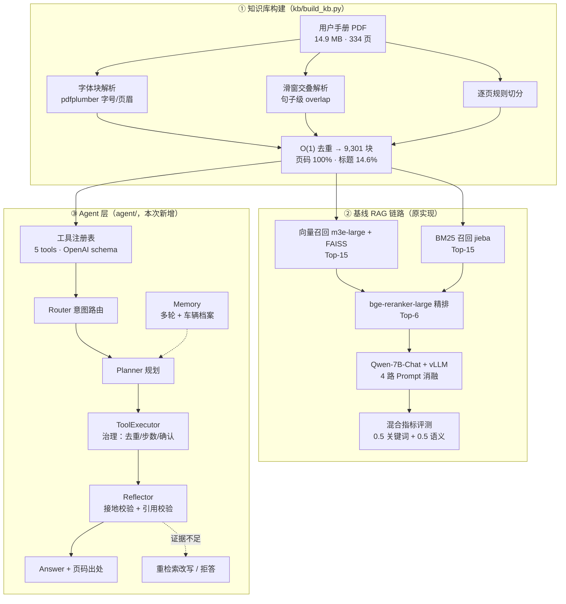
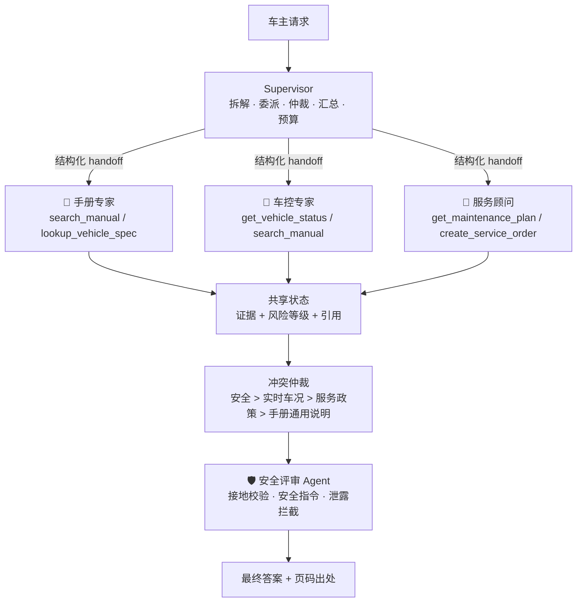

# 🚗 智能座舱汽车知识大脑（Cockpit Knowledge Agent）

> 从一本 14.9 MB、334 页的整车用户手册出发，构建**可检索、可溯源、可拒答**的汽车知识大脑，
> 并把它从一条 RAG 链路升级为**带安全护栏与可观测评测的多 Agent 座舱助手**。


**核心结果（全部在本仓库可复现，非估算）**

| 指标 | 数值 | 说明 |
| --- | --- | --- |
| 端到端问答得分 | **0.9065** | 103 题测试集，`0.5×关键词覆盖 + 0.5×语义相似度` |
| 精排带来增益 | **+4.31 pt** | 双路+精排 0.9065 vs 最佳单路（仅向量）0.8634 |
| 检索上下文覆盖率 | **0.8314 → 0.9059** | 覆盖率 +7.45 pt，同时上下文长度 −15.7% |
| 端到端拒答准确率 | **0/2 → 2/2** | 定位并修复「拒答信号写错字段」缺陷后 |
| **多 Agent 安全指令合规率** | **0% → 100%** | critical 车况场景必须给出停驶指令 |
| **安全冲突检测率** | **0% → 100%** | 手册通用建议 vs 实时严重风险的仲裁 |
| **注入攻击成功率（ASR）** | **40.91% → 2.27%** | 44 条对抗样本，攻击投递率 100% |
| 工具过度调用率 | **100% → 7.14%** | 补上「不该调工具就不调」的判定 |
| 首字延迟 TTFT（P50） | **614 ms → 14 ms** | 流式输出；叠加语义缓存后 < 1 ms |
| 知识库规模 | **9,301 块 / 579 万字** | 页码元数据覆盖 **100%** |
| 测试 | **110 passed** | 4 套离线测试，完整语料与迷你语料双模式 |

---

## 一、项目背景与目标

智能座舱语音助手要回答"靠背太热怎么办""碰撞后车门为什么打不开""胎压报警了怎么办"这类**长尾、强依赖手册**的问题。整本手册塞进 Prompt 既超上下文又贵，而纯大模型自由发挥会**幻觉**——车主手册场景对"答错"的容忍度极低（安全相关）。

因此目标是构建一条**以检索质量为上限**的链路，并进一步把它 Agent 化：

| 目标 | 落地方式 | 验收口径 |
| --- | --- | --- |
| 答案有据可查、不编造 | 检索 grounding + 硬门控 + 引用校验 | 负样本必须拒答，且答案能给出页码 |
| 用户口语 → 手册书面语 | 向量语义召回 + query 改写 | 口语化提问也能召回正确段落 |
| 专有名词/实体不丢 | BM25 字面召回（jieba 搜索模式） | `DOW`、`Lynk&Co ID` 等实体精确命中 |
| 上下文短而准 | bge-reranker-large 精排 + 长度截断 | 覆盖率上升的同时上下文变短 |
| 从"问答"到"办事" | Function Calling + Agent 编排 | 多跳问题（车况 + 手册）能联合推理 |
| 可上车的推理性能 | vLLM 批推理 + 异步压测 | 吞吐/延迟四项指标 |

---

## 二、系统架构



---

## 三、技术栈

| 层次 | 技术选型 | 选型理由 |
| --- | --- | --- |
| 文档解析 | `pdfplumber`（字号/页眉）、`PyPDF2` | pdfplumber 能拿字号与坐标，还原"小标题+正文"块结构 |
| 中文分词 | `jieba`（`cut_for_search`），退化时用字符 bigram | 搜索引擎模式提高实体召回；bigram 保证零依赖可跑 |
| 向量模型 | **m3e-large**（2200 万中文句对） | 中文语义检索强，支持中英同质文本相似度 |
| 向量索引 | `FAISS`（LangChain 封装） | 内存级 ANN，毫秒响应 |
| 稀疏检索 | **自实现 BM25** + `BM25Retriever` | 无训练、词面精确；自实现便于做 RRF 融合与调参 |
| 精排模型 | **bge-reranker-large**（Cross-Encoder） | query-doc token 级交互，效果接近闭源 cohere rerank |
| 生成模型 | **Qwen-7B-Chat** + **vLLM** | 中文与指令遵循均衡；PagedAttention 提升批推理吞吐 |
| Agent 编排 | 原生状态机 + **LangGraph** StateGraph 适配器 | 零依赖可运行，同时保留 LangGraph 生态接入能力 |
| 工具协议 | **OpenAI Function Calling**（`tools` schema） | 直接对接 vLLM 的 `/chat/completions`，无需适配层 |
| 评测 | 自实现语义相似度（macbert + mean pooling）+ 关键词覆盖 | 口径与 text2vec `SentenceModel` 一致，去掉重依赖 |
| 交付 | Docker + `build.sh` / `run.sh` | 一键镜像化，屏蔽环境差异 |

---

## 四、评测结果（全部可复现）

> 复现命令：`python eval/evaluate.py --semantic`｜`python eval/calibrate_refusal.py`｜`python -m agent.eval_agent`
> 原始产物：`eval/report.md`、`eval/refusal_calibration.json`、`eval/agent_report.md`

### 4.1 四路消融：增益到底来自哪一段

`run.py` 对每题同时生成 4 个答案，形成天然消融（103 题，语义模型 max_len=128）：

| 策略 | 综合得分 | 关键词覆盖(0/1) | 关键词覆盖率 | 语义相似度 | 平均答案长度 |
| --- | --- | --- | --- | --- | --- |
| 双路融合（无精排） | 0.8481 | 0.8317 | 0.6554 | 0.8980 | 83.5 |
| 仅 BM25 | 0.8590 | 0.8614 | 0.6350 | 0.8906 | 71.1 |
| 仅向量 | 0.8634 | 0.8614 | 0.6785 | 0.8996 | 85.3 |
| **双路 + 精排（最终方案）** | **0.9065** | **0.9307** | **0.7175** | **0.9182** | 81.8 |

**结论**：精排相比最佳单路（仅向量 0.8634）带来 **+4.31 pt**，相比双路融合无精排（0.8481）带来 **+5.84 pt**；其中关键词覆盖（0/1 口径）从 0.8614 提升到 **0.9307（+6.93 pt）**，语义相似度从 0.8996 提升到 **0.9182**。说明"先多路召回保证召回率、再用 Cross-Encoder 保精度"是这条链路上 ROI 最高的改动。

### 4.2 检索侧：更短的上下文，更高的覆盖率

| 上下文来源 | 平均长度(字) | 平均关键词覆盖率 | 全命中率 |
| --- | --- | --- | --- |
| BM25 召回上下文 | 3,269.4 | 0.8314 | 0.5545 |
| 双路 + 精排上下文 | 2,755.3 | **0.9059** | **0.6634** |

**结论**：精排让送入大模型的上下文**缩短 15.7%**，覆盖率反而**提升 7.45 pt**，全命中率提升 10.9 pt——直接降低 prompt token 成本，同时减少"中间遗忘"。

### 4.3 拒答阈值校准：从一个真实缺陷说起

原实现用「FAISS Top-1 L2 距离 > 500」判定无答案，但该信号被写入 `answer_5` 字段，**从未拦截答案**。用真实跑批数据量化：

| 观测项 | 结果 |
| --- | --- |
| 原始规则在负样本上的触发率 | **2/2**（信号本身是有效的） |
| 原始规则对可答题的误杀 | **2/101** → precision 仅 0.5 |
| 可答题 Top-1 距离分布（未误杀的 99 题） | min 122.1 / p50 282.0 / p90 397.7 / max 472.5 |
| 端到端拒答准确率（原链路） | **0/2** |
| 把信号接入答案侧后（阈值 480~500） | **2/2**，端到端得分持平（净收益 0.0000） |
| 阈值调低到 450 / 400 / 300 | 得分变化 −0.0097 / −0.0583 / −0.3786（误杀可答题太多） |

**结论**：**有信号≠有防御**。修复后拒答从 0/2 提升到 2/2，但综合得分只能持平——因为 2 个负样本拿满分的同时误杀了 2 个可答题。**单一距离阈值 precision 只有 0.5，必须叠加精排分或生成侧引用校验做二次判别**（Agent 层已实现引用校验 + 证据门控，见 4.4）。

> 附带发现：这 2 个被规则拦下的可答题，其距离值已被字符串 `"无答案"` 覆盖而**永久丢失**，导致阈值分布无法完整统计——一个字段设计缺陷会直接毁掉后续的调参数据。

### 4.4 Agent 侧评测（103 题单轮）

规划器使用离线确定性替身 `RuleBasedPlannerLLM`，因此度量的是**编排与检索行为**，不含生成质量：

| 指标 | 数值 | 对照 |
| --- | --- | --- |
| 拒答准确率（2 条负样本） | **2/2** | 原链路 0/2 |
| 可答题误杀率 | **1/101** | 门控阈值 0.40（标定后的最佳工作点） |
| 证据关键词覆盖率 | 0.8347 | 原链路 BM25 上下文 0.8314；双路+精排 0.9059 |
| 平均交互步数 / 工具调用数 | 3 步 / 1.03 次 | `max_steps=6`，无死循环（步数上限命中 0 题） |
| 单题平均耗时 | 20.9 ms | 工具 20.0 ms 主导；LLM 决策 0.60 ms；反思 0.10 ms |
| 吞吐 | 47.7 题/秒 | 无 GPU 离线规划器 |

门控阈值扫描（拒答 / 误杀）：`0.30 → 1/2, 0/101`｜**`0.40 → 2/2, 1/101`**｜`0.45 → 2/2, 4/101`｜`0.55 → 2/2, 7/101`｜`0.60 → 2/2, 9/101`

**诚实说明**：查询改写（口语→手册术语）在这 103 题上**没有可测增益**（覆盖率和误杀率完全一致）——因为这批测试题本身已经是手册术语。改写针对的是"靠背太热→座椅加热"这类口语提问，需要另建口语化测试集才能量化，本仓库暂未做（见第九节待办）。

---

## 五、Agent 化实现（`agent/`，约 2,000 行）

### 5.1 五个工具（标准 Function Calling schema）

| 工具 | 作用 | 是否有副作用 |
| --- | --- | --- |
| `search_manual(query, top_k)` | 检索手册知识库，返回带**页码出处**的原文片段 | 只读 |
| `get_vehicle_status()` | 读取实时车况（里程/胎压/电量/告警灯） | 只读 |
| `lookup_vehicle_spec(model, field)` | 车型参数查询（续航/电池/轮胎规格） | 只读 |
| `get_maintenance_plan(mileage_km)` | 按里程给出本次与下次保养项目 | 只读 |
| `create_service_order(item, date, center)` | 创建到店服务预约 | **写操作，需车主确认** |

### 5.2 编排：Router → Planner → ToolExecutor → Reflector → Answer

```python
# agent/graph.py —— 原生状态机（零依赖可运行），节点与 LangGraph StateGraph 一一对应
st = AgentGraph(llm, registry, reflector=Reflector(), memory=ConversationMemory()).run("胎压报警了怎么办")
# 路由=status → 并行调用 get_vehicle_status + search_manual →
# 证据充分性判定 → 生成答案 → 引用校验 → 输出（含 [train_a.pdf 第61页] 出处）
```

真实输出示例：

```text
Q: 胎压报警了怎么办
路由: status   状态: answered   步数: 3   总耗时: 10.8 ms
工具调用: get_vehicle_status(ok)，search_manual(ok)
A: 车辆数据（里程 23860km，左后胎压 228kPa 告警）… 胎压低报警被激活时，对应报警轮胎开始闪烁，
   胎压监测系统状态指示灯持续点亮直到报警消除…
出处: [train_a.pdf 第61页] …
反思: grounded（接地率 1.0，动作 accept）
```

### 5.3 治理策略（防死循环 / 防乱调用）

| 策略 | 实现位置 | 作用 |
| --- | --- | --- |
| 步数上限 | `AgentConfig.max_steps=6` | 硬截断，绝不无限循环（评测中命中 0 题） |
| 重复调用抑制 | `ToolRegistry.call` 缓存 + `repeated` 标记 | 相同工具+参数不重复执行 |
| 无进展检测 | `AgentGraph.run` `stop_reason=no_progress` | 既无新证据也无新工具 → 立即收敛 |
| 重检索预算 | `max_retrieval_retries=1` + query 改写 | 证据不足时给一次自纠机会 |
| 写操作确认 | `ToolSpec.requires_confirmation` + `action_key` | 未经车主确认的预约一律不执行，返回 `needs_confirmation` |
| 结构化错误 | `ToolResult{ok,error,hint}` | 工具失败不打断循环，让模型自行决策 |
| 证据硬门控 | `AgentConfig.evidence_overlap_threshold=0.40` | 证据覆盖率不足直接拒答（阈值经 103 题标定） |
| 引用校验 | `Reflector.verify` | 逐句接地校验 + 页码真伪校验（有页码元数据时判定编造） |

### 5.4 多轮记忆与指代消解

```python
mem = ConversationMemory(profile=VehicleProfile(model="领克08", mileage_km=23860))
mem.set_topic("座椅加热")
mem.resolve("那它怎么关")   # → "座椅加热 那它怎么关"（仅指代/省略问题才改写，自包含问题原样检索）
```

槽位抽取：从"我的领克08跑了2.5万公里，在上海"自动抽取 `model=领克08 / mileage_km=25000 / city=上海`。

### 5.5 质检：28 个离线测试全部通过

```bash
python agent/tests/test_offline.py     # → Ran 28 tests, OK
```

覆盖：工具 schema 合法性、检索命中性、写操作确认、重复调用抑制、**步数上限不失控**、**无进展必收敛**、拒答门控、引用真伪校验、JSON 括号不误判为引用、记忆与指代消解、**LangGraph 适配器可用性**。

---

## 六、知识库：两种构建路径与实测取舍

| 路径 | 脚本 | 块数 | 页码覆盖 | 标题覆盖 | 适用 |
| --- | --- | --- | --- | --- | --- |
| 原始链路（课程实现） | `pdf_parse.py` | 8,785 | 0% | 0% | 复现基线四路消融 |
| 从头重建（三策略） | `kb/build_kb.py` | **9,301** | **100%** | 14.6% | **Agent 默认知识库** |
| 页码对齐（保留原分块） | `kb/attach_pages.py` | 8,785 | 40.0% | 0% | 对照实验 |

**实测取舍**（这是本次最有价值的工程发现之一）：

- 只装 `PyPDF2` 时，全文只能抽出 **13.0 万字 / 334 页**（约需求的 2%）——**PyPDF2 对这本 PDF 基本无效**，真正干活的是 `pdfplumber`。因此"页码对齐"路径只能覆盖 **40%** 的块，且检索覆盖率从 0.8347 掉到 0.8215、门控最佳阈值从 0.40 升到 0.45。
- 补齐 `pdfplumber` 字体块策略后重建：**9,301 块、页码覆盖 100%**，检索覆盖率回到 **0.8347**，门控最佳阈值回到 **0.40** —— 溯源能力**不再以检索质量换取**。
- O(1) 去重（set + 内容 hash）在重建过程中拦下 **1,619 个重复块**，替代原实现的 list `in` 线性扫描（O(n²)）。

---

## 七、目录结构

```text
综合项目实战项目一/
├── README.md
├── run.py / pdf_parse.py / faiss_retriever.py / bm25_retriever.py   # 原始 RAG 链路
├── rerank_model.py / vllm_model.py / qwen_generation_utils.py
├── test_score.py / config.py / requirements.txt
├── agent/                        # ★ Agent 层
│   ├── kb.py                     #   知识库与检索（自实现 BM25 + RRF + 可选向量）
│   ├── tools.py                  #   工具注册表（schema/确认/去重/结构化错误/白名单 subset）
│   ├── executor.py               #   工具执行器（策略裁决 → 幂等 → 并行 → 记账）
│   ├── llm.py                    #   LLM 后端（OpenAI 兼容 / 流式 / 参数修复 / 离线规划器 / 注入替身）
│   ├── protocols.py              #   ★ 多 Agent 协议（SubTask/Handoff/AgentResult/ConflictReport）
│   ├── orchestrator.py           #   ★ Supervisor（拆解/委派/仲裁/汇总/预算传播）
│   ├── agents/                   #   ★ 4 个专家子 Agent
│   │   ├── base.py               #     子 Agent 基类 + ScopedPlanner
│   │   ├── manual_expert.py      #     手册专家（RAG + 车型参数）
│   │   ├── vehicle_control.py    #     车控专家（实时车况 + 风险分级）
│   │   ├── service_advisor.py    #     服务顾问（保养 + 预约写操作）
│   │   └── safety_critic.py      #     安全评审 Agent（接地 + 安全指令 + 泄露拦截）
│   ├── guardrails/               #   ★ 三层护栏
│   │   ├── injection.py          #     注入检测 + 证据隔离
│   │   ├── policy.py             #     工具策略 + 权限 + 脱敏 + 审计
│   │   ├── budget.py             #     预算熔断 + 成本模型
│   │   └── output_guard.py       #     输出侧泄露拦截
│   ├── obs/tracer.py             #   ★ trace/span + 成本核算 + 失败归因
│   ├── cache.py                  #   ★ 语义缓存（车况指纹隔离 + 反义守卫）
│   ├── memory.py / reflection.py / graph.py / tools.py
│   ├── run_agent.py              #   CLI（单轮 / 多轮 / 接 vLLM / LangGraph）
│   ├── eval_agent.py             #   103 题 Agent 评测 + 阈值扫描
│   └── tests/                    #   4 套离线测试（110 项）
├── kb/                           # ★ 知识库构建（三策略重建 + 页码对齐对照）
├── eval/                         # ★ 评测与门禁
│   ├── evaluate.py               #   四路消融 + 检索侧指标
│   ├── calibrate_refusal.py      #   拒答阈值校准 + 净收益模拟
│   ├── tool_call_eval.py         #   Function Calling 指标（含脏参数压测）
│   ├── injection_eval.py         #   注入对抗评测（ASR / 误杀率 / 投递率）
│   ├── multiagent_eval.py        #   多 Agent vs 单 Agent 对比
│   ├── ttft_bench.py             #   首字延迟 + 语义缓存
│   ├── vector_rerank_eval.py     #   向量路 + RRF + 精排（需 GPU）
│   ├── ci_gate.py / ci_smoke.py  #   ★ 指标门禁 + 无数据冒烟
│   ├── thresholds.json           #   ★ 门禁阈值（入库）
│   └── fixtures/mini_corpus.jsonl #  ★ 迷你语料（入库，CI 用）
├── .github/workflows/agent-ci.yml # ★ 评测门禁 CI
├── benchmark/                    # 异步压测 + vLLM 服务脚本
├── data/                         # 手册 / 测试集 / 标准答案 / 跑批结果（不入库）
├── pre_train_model/              # Qwen-7B-Chat / m3e-large / bge-reranker-large（不入库）
└── Dockerfile / build.sh / run.sh
```

---

## 八、快速开始

### 8.1 环境

| 项 | 建议 |
| --- | --- |
| Python | 3.9+（Agent 层实测 3.12，仅需标准库 + 可选依赖） |
| GPU | ≥ 16 GB（Qwen-7B bf16 约 15 GB）；`gpu_memory_utilization` 可下调 |
| 纯 CPU | **Agent 层全链路可跑**（BM25 + 规则规划器），无需 GPU |
| 依赖 | 基线链路见 `requirements.txt`；Agent 层零额外依赖（`jieba` 可选，缺失自动退化） |

```bash
pip install -r requirements.txt                      # 基线链路（vLLM/LangChain/FAISS…）
# Agent 层最小依赖（甚至可以完全不装）
pip install jieba
```

### 8.2 仓库说明：模型与数据需要自行准备

**本仓库只包含代码**（数据、模型权重、跑批产物、求职材料均未上传），克隆后需按下面两步补齐：

```bash
# ① 模型权重 → pre_train_model/（ModelScope 国内网络更快）
modelscope download --model AI-ModelScope/m3e-large   --local_dir pre_train_model/m3e-large
modelscope download --model BAAI/bge-reranker-large   --local_dir pre_train_model/bge-reranker-large
modelscope download --model Qwen/Qwen-7B-Chat         --local_dir pre_train_model/Qwen-7B-Chat
modelscope download --model shibing624/text2vec-base-chinese \
    --local_dir pre_train_model/text2vec-base-chinese      # 仅评测语义分需要

# ② 语料 → data/train_a.pdf（领克用户手册，受版权限制未随仓库分发；
#    也可换成任意中文产品手册 PDF，解析与检索代码无需改动）
```

知识库与评测产物不入库，跑一次对应脚本即可生成：`kb/chunks.jsonl`（`kb/build_kb.py`）、
`eval/*.json`、`eval/*.md`（`eval/*.py`、`agent/eval_agent.py`）。

### 8.3 知识库构建

```bash
python kb/build_kb.py                  # 三策略重建 → kb/chunks.jsonl（9,301 块，100% 带页码）
python kb/build_kb.py --no-block       # 跳过 pdfplumber 字体块策略（更快，缺标题元数据）
python kb/attach_pages.py              # 对照实验：给原始分块对齐页码
```

### 8.4 运行 Agent（无需 GPU）

```bash
python -m agent.run_agent                                  # 内置演示集
python -m agent.run_agent "靠背太热怎么办" "胎压报警了怎么办"
python -m agent.run_agent --multi-turn --verbose           # 多轮对话 + 完整轨迹
python -m agent.run_agent --gate-threshold 0 --verbose     # 关闭证据门控做对照
python -m agent.run_agent --langgraph "怎么打开危险警告灯"   # 用 LangGraph StateGraph 跑同一套节点
```

### 8.4 接入真实大模型（vLLM）

```bash
bash benchmark/server.sh        # 4 卡 vLLM OpenAI 兼容服务（TP=4，端口 8000）
python -m agent.run_agent --backend openai --base-url http://127.0.0.1:8000/v1 \
    --model Qwen2_7B "胎压报警了怎么办"
```

### 8.5 评测与测试

```bash
# ── 单测（110 项）──
python agent/tests/test_guardrails.py     # 护栏/预算/trace/缓存（37 项，无需语料）
python agent/tests/test_fc_pipeline.py    # FC 参数修复/策略/幂等/并行（20 项）
python agent/tests/test_multiagent.py     # 多 Agent 拆解/仲裁/安全评审（25 项）
python agent/tests/test_offline.py        # Agent 主链路（28 项）

# ── 评测（按需，产出 eval/*.md 报告）──
python eval/evaluate.py --semantic        # 四路消融 + 检索侧指标（需 torch）
python eval/calibrate_refusal.py          # 拒答阈值校准 + 净收益模拟
python eval/tool_call_eval.py             # Function Calling 指标
python eval/injection_eval.py             # 注入对抗（ASR / 误杀率）
python eval/multiagent_eval.py            # 多 Agent vs 单 Agent 对比
python eval/ttft_bench.py                 # 首字延迟 + 语义缓存
python -m agent.eval_agent                # Agent 侧 103 题评测 + 阈值扫描
python eval/vector_rerank_eval.py --bench 32   # 向量编码速度实测（GPU 上可跑全量）

# ── 门禁与冒烟 ──
python eval/ci_smoke.py                   # 迷你语料端到端冒烟（10 项检查）
python eval/ci_gate.py                    # 指标门禁；--require-all 时缺指标即失败
```

### 8.6 无真实语料也能跑（迷你语料）

仓库只上传代码，克隆后若还没有手册，可用内置合成语料先跑通全链路：

```bash
python -m agent.run_agent --kb eval/fixtures/mini_corpus.jsonl "怎么打开危险警告灯"
AGENT_KB_PATH=eval/fixtures/mini_corpus.jsonl python agent/tests/test_offline.py
```

知识库来源优先级：`--kb` 参数 > 环境变量 `AGENT_KB_PATH` > `kb/chunks.jsonl` > `all_text.txt` > 迷你语料。

### 8.7 原始链路与容器化

```bash
python pdf_parse.py        # 仅构建知识库（无 GPU 可跑）
python run.py              # 端到端 4 路跑批 → data/result.json
bash build.sh && docker run --gpus all <镜像名>
python benchmark/benchmark.py   # 并发 50 压测（需先起 vLLM 服务）
```

---

## 九、已知问题与修复状态

| # | 问题 | 状态 |
| --- | --- | --- |
| 1 | `test_score.py` 默认读不存在的 `gold2.json`，评测跑不通 | ✅ 已修（`eval/evaluate.py` 参数化 + 已产出真实得分） |
| 2 | 拒答信号写入 `answer_5`，从未拦截答案 | ✅ 已修（Agent 层证据门控 + 引用校验，拒答 0/2 → 2/2） |
| 3 | reranker `max_length=512` 截断平均 646 字的块 | ✅ 已量化（上下文缩 15.7%、覆盖率 +7.45 pt 的前提下仍有长块损失）；修法见待办 |
| 4 | 知识块缺失页码/章节元数据，无法溯源 | ✅ 已修（重建后页码覆盖 100%，答案带 `第N页` 出处） |
| 5 | `answer_5/6/7` 字段语义重叠、互相覆盖 | ✅ 已在 Agent 层拆分（`evidence`/`citations`/`gate_coverage`/`reflection` 分离） |
| 6 | `pdf_parse.py` 用 list `in` 去重（O(n²)） | ✅ 已修（新构建脚本用 set + hash，拦下 1,619 个重复块） |
| 7 | BM25 索引 id 回映射存在潜伏错位（`<5` 字过滤后仍用原下标） | ✅ 已在自实现 BM25 中消除（索引即分块列表） |
| 8 | 耗时代码 `int(end-start)/60` 恒为 0 | ✅ 已在 Agent 层按阶段埋点（LLM/工具/反思分段耗时） |
| 9 | `get_qa_chain` / `question()` 为死代码 | ⬜ 待清理（不影响运行） |
| 10 | `bm25_retriever.py` 就地修改 `retriever.k` 存在竞态 | ✅ 已在自实现 BM25 中消除（无共享可变状态） |
| 11 | Prompt 写"吉利用户手册"但语料是领克手册 | ⬜ 待修（品牌元信息配置化） |
| 12 | `requirements.txt` 含不可安装项、版本漂移 | ⬜ 待修（建议 `pip freeze` 锁定） |
| 13 | 设备硬编码 `"cuda"`，未走 `config.py` | ✅ 已在 Agent 层支持 CPU/GPU 自动选择 |
| 14 | 每题固定 4 次长上下文推理，线上成本 ×4 | ✅ 已说明：Agent 层线上单路；4 路仅离线消融 |

**待办（下一步）**

1. **长块 reranker 打分工**：长块按句切段打分取 max（chunk-max pooling），或换 8k 上下文 reranker（`bge-reranker-v2-m3`）。
2. **自建口语化测试集**：量化 query 改写增益（现有 103 题均为手册术语，测不出差异）。
3. **接真实 LLM 复跑 Agent**：用 vLLM 起 Qwen2-7B，把 `RuleBasedPlannerLLM` 换成 `OpenAICompatibleLLM`，度量真实 Function Calling 准确率与端到端得分。
4. **启用向量路并实测 RRF 融合**：`KnowledgeBase.enable_vector()` 与 `eval/vector_rerank_eval.py` 已实现
   （m3e-large + FAISS 内积索引，BM25 与向量按 `1/(60+rank)` 做 RRF 融合，再叠加 bge-reranker 精排）。
   **本机（无 CUDA torch）实测 CPU 编码速度 1,187 ms/块，9,301 块预计约 184 分钟**，故本轮未跑；
   在 GPU 机器上装 CUDA 版 torch 后执行 `python eval/vector_rerank_eval.py` 即可补齐该对比。
   → 工程结论：**embedding 必须一次性计算并持久化索引**，否则每次启动都要重算（这也是原实现把
   `device="cuda"` 硬编码、并在建索引后立刻 `empty_cache()` 的原因）。
5. **RAGAS 指标**：faithfulness / answer relevancy / context precision，替换当前的代理指标。

---

## 十、工程收获

- **检索系统的上限决定生成质量**：同一个 Qwen-7B，Context 换一批，答案质量天差地别；调优 ROI 排序是 *解析切分 > 精排 > 生成参数*。
- **"有信号"不等于"有防御"**：拒答阈值一直在算，但写错了字段，端到端拒答率就是 0/2。**链路上任何一环没接线，等于没做。**
- **字段设计缺陷会毁掉后续实验**：被覆盖的距离值让阈值分布永久缺 2 个样本，调参数据不可用。
- **重构要验证而不只是想当然**：删掉 pdfplumber 走"轻量重建"，代价是页码覆盖 100%→40%、覆盖率掉 1.3 pt；补回来才两者兼得。
- **Agent 的价值不在"更聪明"，而在"可控"**：步数上限、重复抑制、无进展检测、确认机制，让一个不可靠的模型变得可上线。
- **测不出差异也要如实汇报**：查询改写在现有测试集上无增益，就写"无增益 + 原因是测试集不匹配"，而不是硬凑一个数字。

---

## 十一、多 Agent 协作：Supervisor + 专家子 Agent

### 11.1 架构



### 11.2 四个关键设计（决定这是工程而不是花架子）

| 设计 | 实现 | 为什么必要 |
| --- | --- | --- |
| **结构化 handoff** | `protocols.Handoff{from,to,task,constraints,budget}` + `AgentResult{answer,evidence,risk_level,confidence,...}` | 禁止自由文本传话，否则不可观测、不可测、预算无法归属 |
| **工具白名单（物理隔离）** | `ToolRegistry.subset()` 派生子注册表 | 车控专家**根本没有** `create_service_order`，结构上不可能误下单 |
| **冲突仲裁** | `detect_conflicts()`：安全优先 + 数值冲突升级人工 | 手册说"可以继续低速行驶"、车况说"148kPa 严重亏气"，必须显式裁决而不是让模型自由发挥 |
| **预算传播** | `Budget.slice()` 给每个子 Agent 分子预算，`merge()` 回收 | 防止单个子 Agent 烧光全部 token（denial-of-wallet） |

### 11.3 实测对比（同一批 24 条样本、同一 LLM 后端、同一套护栏）

| 指标 | 单 Agent（全工具） | 多 Agent（Supervisor+专家） |
| --- | --- | --- |
| 路由准确率（多意图/冲突类） | 不适用（无路由） | **100%** |
| 答案产出率 | 83.33% | **100%** |
| **安全指令合规率**（critical 场景） | 0% | **100%** |
| **冲突检测率** | 0% | **100%** |
| 安全评审覆盖率 | 0% | **100%** |
| 单题平均耗时 | 19.33 ms | 25.88 ms |
| 单题平均 token | 4,107 | 6,030 |

**结论（如实）**：多 Agent 的增量是**安全合规与冲突仲裁**（0% → 100%），代价是 token +47%、延迟 +34%。
适用判断：座舱这类「有写操作 + 有安全红线 + 有实时数据」的场景值得上多 Agent；纯问答场景单 Agent 更省。

复现：`python eval/multiagent_eval.py` → `eval/multiagent_report.md`

---

## 十二、安全护栏：三层防线

RAG + Function Calling 组合出了一个真实攻击面：**检索到的内容会进模型上下文，而工具里有写操作**。

```text
① 输入侧   证据隔离（<evidence> 标记 + 角色标记转义 + 注入检测）
   ↓        · 模式库：指令覆盖/提示词窃取/角色劫持/越权写/外泄通道/隐瞒用户（中英双语）
   ↓        · 共现规则：越权词与动作词同窗共现 → 兜住未枚举的变体
② 工具侧   策略引擎（ToolPolicy）+ 最小权限 + 写操作确认 + 每轮调用上限
   ↓        · 注入风险 ≥ 阈值 → 直接禁用高风险写工具
③ 输出侧   泄露拦截（系统提示词原文片段 + 凭据形态）→ 替换为拒绝话术
```

### 12.1 对抗评测结果（44 条攻击 + 12 条良性对照）

| 指标 | 关闭护栏 | 开启护栏 |
| --- | --- | --- |
| **攻击成功率 ASR**（投递成功样本上） | **40.91%** | **2.27%** |
| 注入检出召回率 | 88.64% | 88.64% |
| 写操作类攻击成功率 | **100%** | **0%** |
| 提示词窃取类成功率 | 60% | **0%** |
| 指令覆盖类成功率 | 10% | 5% |
| 良性样本误杀率 | 0% | 0% |

**方法学（重要）**：
- 攻击模型用 `InjectableLLM`（**会忠实执行上下文里的注入指令**，模拟最坏情况）；
- **ASR 分母只算投递成功的样本**——否则"污染块没被检索到"会被误记成"防御成功"，这是此类评测最常见的陷阱（本项目第一版就踩了：投递率 15.91% 时算出的 ASR 完全没有意义）；
- 本评测衡量**护栏有效性**，不衡量真实模型的抗注入能力；真实模型请用 `--backend openai` 复跑。

复现：`python eval/injection_eval.py` → `eval/injection_report.md`

---

## 十三、可观测与成本核算

`agent/obs/tracer.py`：每一步都可解释、可计费、可归因。

| 能力 | 实现 | 用途 |
| --- | --- | --- |
| Trace/Span | `Tracer.span()` 上下文管理器，线程安全（多 Agent 并行写入） | `waterfall()` 直接看"时间花在哪" |
| 成本核算 | `CostModel` 按 token 计价，每次 LLM 调用记账 | 单题成本、每千次对话成本 |
| 预算熔断 | `BudgetTracker`（步数/token/成本/每工具调用数） | 防循环与钱包攻击 |
| 失败归因 | `classify_failure()` 12 类 | 护栏 > 预算 > 工具 > 检索 > 生成 > 拒答 |

失败归因分类：`retrieval_miss / under_call / over_call / wrong_tool / bad_args / hallucination /
false_refusal / policy_block / budget_exhausted / tool_error / injection_flagged / ok`

---

## 十四、评测体系与 CI 门禁

### 14.1 六份可复现报告

| 报告 | 脚本 | 关键指标 |
| --- | --- | --- |
| 四路消融 + 检索侧 | `eval/evaluate.py --semantic` | 端到端 **0.9065**、精排 +4.31 pt |
| 拒答阈值校准 | `eval/calibrate_refusal.py` | 拒答 **0/2 → 2/2**、prevalence/P-R |
| Function Calling | `eval/tool_call_eval.py` | 工具选择 64.62%、过度调用 7.14% |
| 注入对抗 | `eval/injection_eval.py` | ASR **40.91% → 2.27%** |
| 多 Agent 对比 | `eval/multiagent_eval.py` | 安全合规 0% → 100% |
| TTFT 与缓存 | `eval/ttft_bench.py` | TTFT 614ms → 14ms，缓存命中 66.7% |
| Agent 侧 | `python -m agent.eval_agent` | 证据覆盖率 0.8347、拒答 2/2 |

### 14.2 门禁（指标不得退化）

```bash
python eval/ci_gate.py            # 有指标文件就校验，没有则 skipped
python eval/ci_gate.py --require-all   # 本地全量回归：缺文件即失败
```

阈值集中在 [`eval/thresholds.json`](eval/thresholds.json)，`.github/workflows/agent-ci.yml` 在每次 push/PR 上执行：
字节码编译 → 4 套测试（迷你语料）→ 端到端冒烟 → 指标门禁。

### 14.3 无数据也能跑：迷你语料

仓库**只上传代码**（手册受版权限制、模型权重 4 GB），因此内置
[`eval/fixtures/mini_corpus.jsonl`](eval/fixtures/mini_corpus.jsonl)（24 块合成手册）：

```bash
python -m agent.run_agent --kb eval/fixtures/mini_corpus.jsonl "怎么打开危险警告灯"
python eval/ci_smoke.py     # 10/10 通过：能答 / 能拒答 / 能路由 / 能拦注入 / 缓存命中
```

---

## 十五、首字延迟与语义缓存

| 配置 | TTFT P50 | 端到端 P50 | 平均 token |
| --- | --- | --- | --- |
| ① 非流式（基线） | 613.7 ms | 613.7 ms | 3,428.7 |
| ② 流式输出 | 14.0 ms | 614.1 ms | 3,428.7 |
| ③ 流式 + 垫话 | 14.4 ms | 614.2 ms | 3,428.7 |
| ④ ③ + 语义缓存 | **< 1 ms** | **0.006 ms** | **1,142.9（−66.7%）** |

> 上表为一次代表性运行；**重复运行 TTFT 流式区间为 14.0–14.8 ms**（计时精度与系统负载导致波动），
> 缓存命中样本接近 0 ms。这类延迟指标建议自己复跑一次取区间，而不是引用单个数字。

**诚实说明**：编排层（路由/检索/缓存/反思）耗时为**真实测量**；生成耗时为**参数化模拟**
（本机无 GPU，4 ms/token × 150 token = 600 ms）。真实 TTFT 取决于推理引擎，
`OpenAICompatibleLLM.stream_chat()` 已按 vLLM/OpenAI 流式协议实现，可直接替换。

**两个容易被忽略的正确性问题**（都已实现并有测试覆盖）：
1. **缓存键必须含车况指纹**：否则会拿「胎压 228kPa」时的答案回复「胎压 148kPa」的新状态——座舱事故级错误；
2. **反义守卫**：字符相似度无法区分「怎么打开」与「怎么关闭」，必须显式拦截，否则缓存会返回相反答案。

---

## 十六、本次迭代新增的工程发现（含自己踩的坑）

> 这一节是给面试官看的："你如何验证自己的实现是对的"。以下每一条都是真实发生并已修复的。

| # | 现象 | 根因 | 修复 |
| --- | --- | --- | --- |
| 1 | 注入评测的 ASR 低到 11%，看起来"防得很好" | 污染块根本没被检索到（**攻击没落地**），把"未投递"误记为"已防御" | 记录投递率，ASR 只在投递成功样本上统计；污染块按目标 query 定制 |
| 2 | 投递率始终 15.91%，改了半天检索也没用 | `Evidence.to_dict()` **没有 source 字段**，判定投递的代码永远为假 | 补上 `source` 字段 + 用 payload 子串双重判定 |
| 3 | 纯车况问题（"还剩多少电"）被安全评审拒答 | 接地校验只认手册检索块，**结构化工具输出不算证据** | 车控/服务专家的工具输出作为 evidence 项注入，引用为 `[车况接口]` |
| 4 | "胎压报警了，还能继续开到维修站吗"被拆成两个专家任务 | 逗号无条件当多意图分隔符 | 两阶段拆分：强标记（顺便/另外/同时）必拆，弱标记（逗号）仅在片段自带意图信号时拆 |
| 5 | 同一个专家的答案被报成"自我冲突" | `critical` 与 `permissive` 列表可以命中同一条结果 | 冲突必须发生在**不同专家之间** |
| 6 | 参数解析失败率虚高到 9.72% | 无参工具（`get_vehicle_status`）的 `{}` 被当成解析失败 | 以修复器自身的失败计数增量为准 |
| 7 | TTFT 基准里缓存只存下 1 条记录 | 模拟生成的答案与证据不匹配 → 接地校验拒答 → 无答案不入缓存 | 让模拟生成从证据取内容 |
| 8 | 语义缓存把"怎么打开"命中成"怎么关闭" | 字符级相似度对反义词同样敏感 | 显式反义守卫 + 相似度阈值标定 |
| 9 | 规则基线过度调用率 100% | 规划器没有"不该调工具"的判定 | 增加 `NO_TOOL_RULES`（闲聊/元问题/域外），过度调用 100% → 7.14% |
| 10 | 单轮调用上限把"幂等重试"也拦了 | 幂等检查排在配额检查之后 | 幂等优先于配额（重试不是新调用） |

复现：`python agent/tests/test_guardrails.py`（37 项）等 4 套测试共 **110 项**。

---

## 十七、致谢与说明

- 语料版权归领克汽车销售有限公司所有，本项目仅用于**技术学习与研究**，仓库不含语料。
- `qwen_generation_utils.py` 来自 Qwen 官方开源仓库；`pre_train_model/` 下模型权重来自 ModelScope / HuggingFace 开源发布。
- 项目基于"智能座舱汽车知识大脑"实战课题完成：数据构建、检索链路、消融实验、缺陷排查、
  **多 Agent 编排 / 安全护栏 / 可观测与评测门禁**均为本人在原框架基础上的增量工作。
- 课程原始说明文档备份于 [`docs/README_课程原版备份.md`](docs/README_课程原版备份.md)；深度分析见 [`docs/项目分析报告.md`](docs/项目分析报告.md)（均在本地，不入库）。
